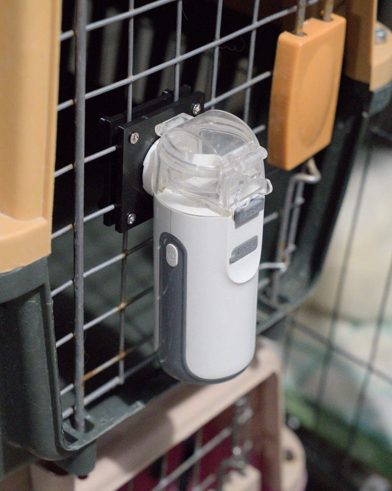
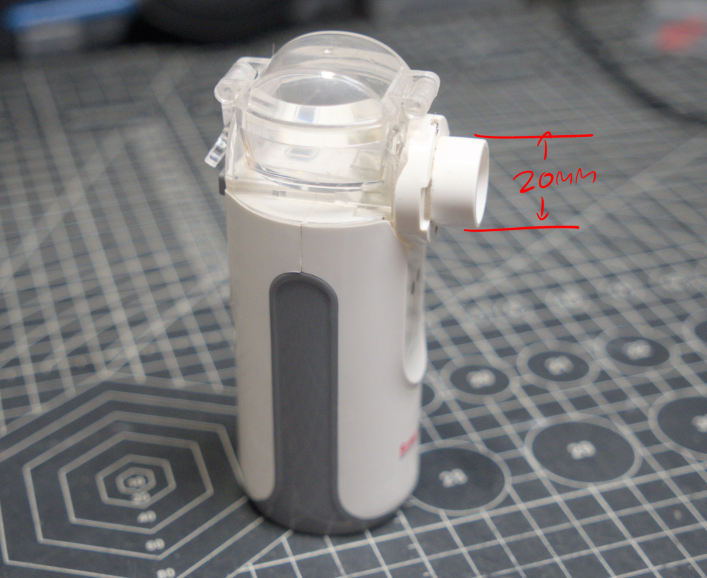
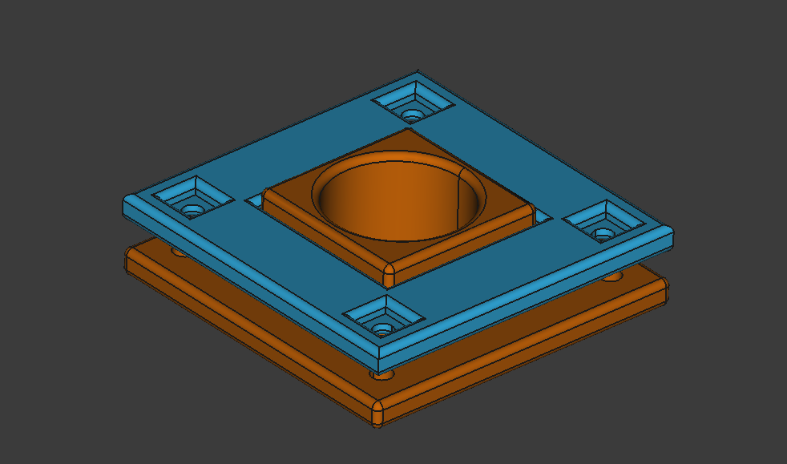

# Custom Gridfinity Bins by Benjie
[![CC BY 4.0][cc-by-shield]][cc-by-sa]

 

At [kittie.club](https://www.instagram.com/kittie.club), we often need to nebulize some of our sick cats. This usually involves placing the patient inside a carrier with a portable nebulizer to help them breathe more easily.

To streamline the process, I designed this simple mount to quickly and securely attach a portable nebulizer to a cat carrier.

This is designed for a portable nebulizer with an outer diameter of 20mm and a cat carrier with 25mm spacing. 

## License
All work under this collection is licensed under a
[Creative Commons Attribution-ShareAlike 4.0 International License][cc-by-sa], unless noted otherwise.

[cc-by-sa]: http://creativecommons.org/licenses/by-sa/4.0/
[cc-by-shield]: https://img.shields.io/badge/License-CC%20BY%20BY%20SA%204.0-lightgrey.svg